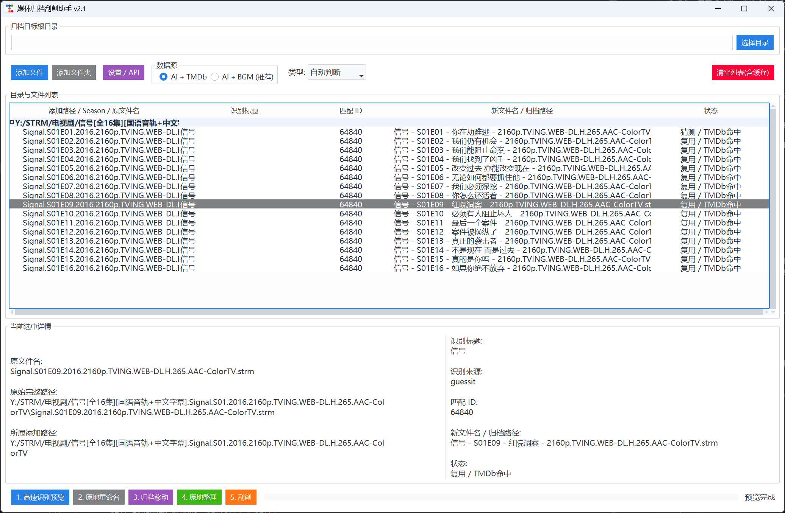
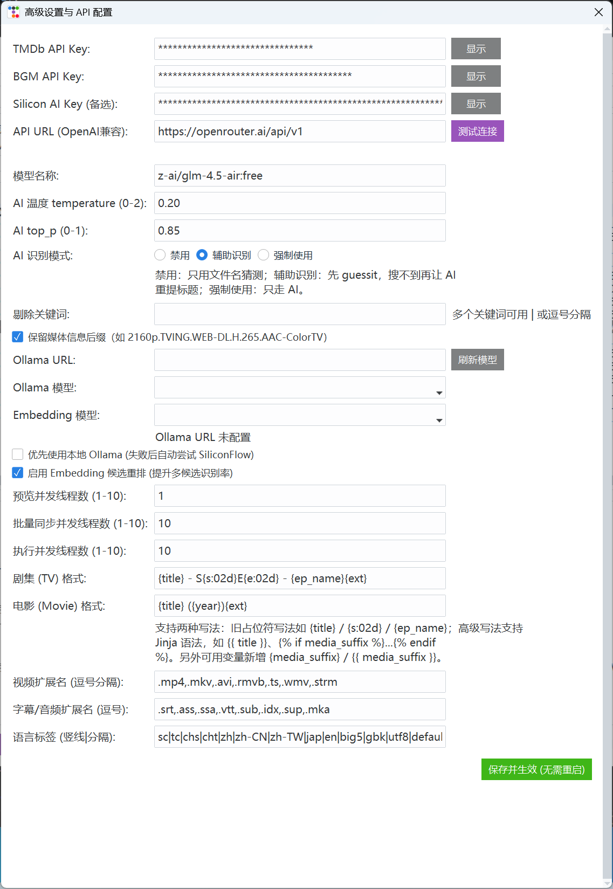

# 媒体归档刮削助手 v2.8
TG 问题反馈群：<https://t.me/+Wx34NdYY_x1iNjg1>

一个面向动漫、剧集、电影、STRM 场景的桌面端媒体整理工具。 AIkey如果不是收费的情况下，推荐是使用本地AI+Embedding 模型使用效果最佳！以免限速导致的识别问题！模型推荐qwen3.5 9B+nomic-embed-text或者 bge-m3 Embedding 模型！
支持批量识别、手动锁定、原地重命名、归档移动、原地整理、NFO/图片刮削，以及本地 Ollama / OpenAI 兼容接口混合识别。

## 快速跳转

- [项目亮点](#highlights)
- [适用场景](#scenarios)
- [界面预览](#preview)
- [功能概览](#features)
- [推荐工作流](#workflow)
- [最近维护更新](#changelog)
- [环境要求](#install)
- [运行](#run)
- [测试](#test)
- [配置说明](#config)
- [文件名模板](#templates)
- [项目结构](#structure)

命名模板可用变量说明：  
- [GitHub Wiki - 命名模板可用变量](https://github.com/shai102/media-renamer-ai/wiki/Naming-Template-Variables)

## <a id="highlights"></a>项目亮点

| 模块 | 说明 |
| --- | --- |
| 分组树工作流 | 固定为 `添加路径 -> Season/子目录 -> 文件` 的树形批处理视图 |
| 双数据源匹配 | 支持 `TMDb` 与 `Bangumi(BGM)`，TMDb 无结果时可自动回退 BGM |
| AI 混合识别 | 支持 `禁用 / 辅助识别 / 强制使用` 三档模式，兼容 `Ollama` 与 OpenAI 兼容接口；测试连接时自动检测并显示深思模式状态 |
| 批量整理能力 | 支持原地重命名、归档移动、原地整理、独立刮削 |
| 模板命名 | 同时兼容旧占位符模板和 Jinja 风格高级模板 |
| 元数据保留 | 可保留 `2160p.WEB-DL.H.265...` 等媒体信息后缀 |
| 桌面交互 | 基于 `Tkinter + ttkbootstrap (Cosmo)`，支持海报卡片候选选择 |
| 固定底栏弹窗 | 候选较多时列表区滚动，底部确认/跳过/取消按钮始终可见 |

## <a id="scenarios"></a>适用场景

- 动漫 / 剧集 / 电影 / STRM 文件批量识别
- 番组压制组、片源标签、年份、季集信息混杂的文件名清洗
- 将零散目录整理成 Jellyfin / Emby / Kodi 可识别的媒体库结构
- 为已识别媒体批量生成 `nfo`、`poster`、`fanart`、`still`
- 本地媒体库补刮削、补命名、补元数据

## 首屏预览

当前 GUI 已经从早期的平铺列表演进为更适合批量目录整理的分组树形工作流，主打“先预览确认，再批量执行”。



## <a id="preview"></a>界面预览

### 主界面


### 设置与模板



## <a id="features"></a>功能概览

- 分组树视图：GUI 固定为 `添加路径 -> Season/子目录 -> 文件` 的树形结构；如果导入目录本身就是平铺文件，则直接显示为 `添加路径 -> 文件`。
- 作用域批处理：底部按钮会按当前焦点所在分组工作。
  - 焦点在文件：处理所属 Season / 当前子组
  - 焦点在 Season：处理该 Season
  - 焦点在顶层添加路径：处理该路径下全部文件
- 作用域全选：在分组树中按 `Ctrl+A` 时，只会选中当前焦点分组下的文件，不会跨到其他分组。
- 高速识别预览：支持并发识别、目录级缓存复用、手动锁定与批量同步。
- AI 三档识别模式：
  - `禁用`：只用文件名猜测与数据库搜索
  - `辅助识别`：先 `guessit`，搜不到再让 AI 重提标题后二次搜索
  - `强制使用`：只走 AI，失败直接待手动确认
- 关键词过滤：支持在识别前剔除干扰关键词，提升番剧、压制组、片源标签混杂文件名的匹配成功率。
- 文件名模板升级：
  - 旧占位符模板继续兼容，例如 `{title} - S{s:02d}E{e:02d} - {ep_name}{ext}`
  - 新增高级模板语法，支持类似 Jinja 的 `{{ title }}`、`...` 写法
  - 文件夹结构保持当前默认规则，升级仅作用于“文件名模板”
- 媒体信息后缀保留：
  - 可从原文件名中提取如 `2160p.TVING.WEB-DL.H.265.AAC-ColorTV` 这类尾缀
  - 支持通过 `{media_suffix}` 或 `{{ media_suffix }}` 写入命名模板
  - 也可在设置中启用“保留媒体信息后缀”，在模板未显式写入时自动追加到扩展名前
- 数据库匹配：支持 TMDb 与 Bangumi（BGM）。
  - 选 `AI + TMDb` 时，如果 TMDb 无结果，会自动回退到 BGM
  - 回退命中后会按实际命中来源继续走元数据与命名链，不会硬套错源
- 年份与季信息补全：
  - 文件名缺少年份时，会向上查找父目录中的年份
  - Season 信息可从文件名和目录名共同推断
- 原地重命名：只在原目录改名，不调整媒体库目录结构。
- 归档移动：按配置的目标根目录生成媒体库结构并移动文件。
- 原地整理：以添加路径的上一级目录作为整理根目录，在本地建立标准媒体库结构。
  - 原地整理后会自动继续刮削，不需要再额外点一次“刮削”
  - 原目录清空后会自动删除空目录
- 独立刮削：可单独为已识别文件补写 `nfo`、`poster`、`fanart`、`still`
- 手动匹配增强：右键手动精准匹配、批量锁定、候选选择与海报卡片交互。
- 候选弹窗固定底栏：手动确认候选较多时，候选列表区域会滚动显示，`确认选择`、`跳过此文件夹`、`取消` 等操作按钮始终固定可见。
- 组右键快捷预览：顶层分组和 Season 分组右键可直接执行高速识别预览。
- 响应式设置窗口：设置 / API 页面会跟随窗口宽度自动调整输入框宽度与说明文本换行。
- 设置窗口固定保存栏：较长配置项会在中部滚动，底部“保存并生效”按钮始终固定可见。
- Cosmo 主题美化：主窗口、设置页、按钮、Treeview、详情区已统一到 `ttkbootstrap` 的 `Cosmo` 浅色主题风格。
- EXE 程序图标：运行窗口和打包后的 EXE 都已使用项目专属图标。

## <a id="workflow"></a>推荐工作流

推荐使用顺序：

1. 添加文件或文件夹
2. 在树视图中选中要处理的作用域
3. 点击 `1. 高速识别预览`
4. 根据需要执行：
   - `2. 原地重命名`
   - `3. 归档移动`
   - `4. 原地整理`（整理后自动刮削）
   - `5. 刮削`

说明：

- “原地整理”适合把零散 STRM / 视频目录直接整理成 Jellyfin / Emby / Kodi 可识别的媒体库结构。
- “归档移动”适合把源目录内容整理到另一个媒体库根目录。

## <a id="changelog"></a>最近维护更新（当前 GUI 版本：v2.9）

### v2.9 更新

- 识别链路与 Web 版进一步对齐：
  - 同步标题提取、候选搜索、关键词清洗与季集归档修复
  - 修复 `SXXE00` 被误归档到 `SXXE01` 的问题，特殊集改走 `S00E??` 或按规则跳过
  - 额外规避年份数字（如 `[2024]`）被误识别为集数
- TMDB 搜索回退与标题纠偏增强：
  - 改善发布组名、罗马音、标点变体、英文标题等场景下的搜索命中率
  - 优化标题归一化与别名搜索，减少明明能在 TMDB 搜到却未命中的情况
- 发版前清理与整理：
  - 移除测试产物与本地配置残留，保持仓库发布内容更干净

### v2.8 更新

- 同文件夹同季识别复用增强：
  - 目录解析缓存改为按 `文件夹 + 季号` 分槽，`S01`、`S02`、`S00` 不互相串用
  - 同一文件夹同一季只需首个文件完成 AI/guessit 解析，后续文件复用标题、年份、数据库候选链路
  - 并发预览时新增目录解析等待事件，减少同目录多集同时重复请求 AI
- 在线 AI 候选判定增强：
  - OpenAI 兼容接口现在可参与 TMDb/BGM 多候选判定
  - 未启用“优先使用本地 Ollama”时，候选判定优先交给在线 AI
  - 在线 AI 候选判定 prompt 增加原始标题、年份、评分、简介等上下文
  - 候选判定返回支持宽松 JSON / 纯数字 / `pick: N` 等容错解析
- 本地/在线候选自动化策略统一：
  - 抽出通用候选评分函数，便于后续迁移到全自动项目
  - 手动候选弹窗前新增自动判定兜底，减少多候选阻塞
  - 未优先使用 Ollama 时，本地 Embedding 重排不再被隐式调用
- 工程与打包整理：
  - 新增 `.editorconfig`，统一文本编码为 UTF-8
  - 打包脚本改为 UTF-8 并自动切换代码页，避免中文 EXE 名称和提示乱码

### v2.5 更新

- 辅助识别改为真正的混合识别：
  - `guessit` 标题不可靠时，优先拉起 AI 参与解析
  - 标准剧集命名不再因为中文 Season 目录名被误判成必须走 AI
- 数据库搜索策略收紧：
  - 当 `guessit` 没识别出有效标题、且本次由 AI 识别时
  - TMDb / BGM 搜索只使用 AI 返回的标题，不再混入 `Baha`、字幕组名、目录名等噪音搜索词
- 同目录识别复用修复：
  - 目录缓存新增标题别名，支持中文标题结果复用英文/罗马音文件名
  - 修复“首集成功、后续不复用”以及“中文标题无法复用英文文件名”的问题
- OpenRouter / OpenAI 兼容接口增强：
  - 兼容 `content` 数组、`reasoning`、`reasoning_content`、`output_text` 等响应结构
  - “测试连接”改为固定短指令，降低空响应导致的误报
- AI 限流场景稳定性修复：
  - 新增本地 AI 请求节流，按分钟窗口主动排队，减少撞上游 `429`
  - 辅助识别遇到 `429 / rate limit` 时，不再退回脏的 `guessit` 标题继续搜库
  - 同目录后续文件一旦成功建立缓存，会自动回填重试之前被标记为“AI限流”的兄弟文件
- 识别状态提示优化：
  - `429 / rate limit` 统一显示为“AI接口限流，请稍后重试”

### 新增功能

- 分组树视图固定化：
  - 去掉旧的 GUI 列表视图切换
  - 主界面统一改为 `添加路径 -> Season/子目录 -> 文件`
  - 平铺目录自动压平成 `添加路径 -> 文件`
- 新的详情面板：
  - 主表格下方改为左右双栏详情区
  - 长路径、长状态、长目标路径自动换行显示
- AI 三档模式：
  - 新增 `禁用 / 辅助识别 / 强制使用`
  - 设置窗口可直接切换
- 剔除关键词：
  - 新增全局“剔除关键词”配置
  - 识别前自动清洗文件名
- 原地整理模式正式加入底部按钮：
  - 保留 `原地重命名`
  - 保留 `归档移动`
  - 新增 `原地整理`
- 原地整理联动刮削：
  - 整理完成后自动写入 NFO / 图片
  - 不需要再单独执行刮削
- 空目录自动清理：
  - 原地整理成功后，会从旧目录开始向上删除空目录
  - 删除会在整理根目录前停止
- 作用域批处理：
  - 底部按钮按当前焦点分组执行
  - `Ctrl+A` 只选当前分组
- 组右键快捷预览：
  - 顶层分组右键支持“高速识别预览该分组”
  - Season 组右键支持“高速识别预览该 Season”
- Cosmo 主题美化：
  - 主程序默认接入 `ttkbootstrap`
  - 主界面和设置页统一为 `Cosmo` 浅色桌面风格
  - 顶部工具带、主列表区、详情区、底部操作栏都做了卡片化和分色
- 高级文件名模板：
  - 新增 `core/services/template_service.py`
  - 文件名模板同时支持旧占位符写法和 Jinja 风格高级写法
  - 新增模板变量 `media_suffix`
- 专属程序图标：
  - 新增 `assets/app_icon.ico`
  - 运行窗口和打包生成的 EXE 共用同一套图标资源

### 识别链增强

- AI 模式统一接入 TMDb / BGM 两条识别链
- 文件名缺少年份时，向上遍历父目录补年份
- 新增 `parse_source` 识别来源记录（`guessit` / `ai`）
- 目录缓存增加识别来源标记，避免不同 AI 模式误复用旧结果
- 数据库缓存键加入文件夹数据库 ID，减少串缓存误命中
- `AI + TMDb` 无结果时自动回退到 BGM，并按实际命中源继续后续逻辑

### 稳定性与交互修正

- 右键菜单兼容顶层组、Season 组、文件三种节点
- 组节点右键支持直接执行“高速识别预览该分组 / 该 Season”
- 分组树刷新后保留已展开状态与选择状态
- 设置窗口改为响应式布局，输入框与说明文字会随窗口宽度自动适配
- 手动匹配候选弹窗改为固定底部操作栏，候选较多时不再遮挡“确认选择 / 跳过此文件夹”
- 手动搜索结果弹窗同步改为固定底部操作栏，避免“确认选择 / 取消”被候选列表挤出可视区
- 设置窗口保存区固定到底部，长内容场景下不需要滚到最底部才能点击保存

## <a id="install"></a>环境要求

- Python 3.10+
- 依赖见 `requirements.txt`

安装依赖：

```bash
pip install -r requirements.txt
```

## <a id="run"></a>运行

```bash
python main.py
```

## <a id="test"></a>测试

统一测试命令：

```bash
python -m unittest discover -s tests -v
```

Windows 可直接运行：

```bat
run_tests.bat
```

## <a id="config"></a>配置说明

在 GUI 的“设置 / API”页面可配置：

- TMDb API Key
- BGM API Key
- OpenAI 兼容 API URL 与 Key（测试连接时会显示深思模式状态）
- 模型名称
- AI 温度 / top_p
- AI 识别模式：`禁用 / 辅助识别 / 强制使用`
- 剔除关键词
- Ollama URL / Ollama 模型 / Embedding 模型
- 是否优先使用本地 Ollama
- 是否启用 Embedding 候选重排
- 并发参数（预览、同步、执行）
- 命名模板与扩展名规则
- 是否保留媒体信息后缀（如 `2160p.TVING.WEB-DL.H.265.AAC-ColorTV`）

配置保存在本地 `renamer_config.json`（已在 `.gitignore` 中排除）。

## <a id="templates"></a>文件名模板

当前项目的“文件名模板”已经支持两种写法：

### 1. 旧占位符写法

示例：

```text
{title} - S{s:02d}E{e:02d} - {ep_name}{ext}
```

这个写法会继续兼容，你现有配置不用重写。

### 2. 高级模板写法

示例：

```jinja2
{{ title }} - S{{ season }}E{{ episode }} - {{ ep_name }} - {{ media_suffix }}{{ ext }}
```

这个写法适合做更复杂的显示逻辑，例如：

- 有集标题才显示 ` - {{ ep_name }}`
- 有媒体后缀才显示 ` - {{ media_suffix }}`
- 电影和剧集可以分别写成不同风格

### 当前可用变量

| 变量 | 说明 | 示例 |
| --- | --- | --- |
| `title` | 识别后的标准标题 | 剑来 |
| `year` | 年份 | 2024 |
| `season` | 季号，两位数字字符串 | `01` |
| `episode` | 集号，两位数字字符串 | `08` |
| `s` | 兼容旧模板的季号变量 | `01` |
| `e` | 兼容旧模板的集号变量 | `08` |
| `ep_name` | 集标题 | 天涯咫尺 |
| `ext` | 扩展名，包含点号 | `.strm` |
| `media_suffix` | 原文件名中的媒体信息后缀 | `2160p.TVING.WEB-DL.H.265.AAC-ColorTV` |
| `parse_source` | 标题解析来源 | `guessit` / `ai` |
| `source_provider` / `provider` | 命中的数据源 | `tmdb` / `bgm` |
| `media_id` | 当前命中的数据库 ID | `259537` |
| `tmdbid` | 当来源为 TMDb 时可用 | `259537` |
| `bgmid` | 当来源为 BGM 时可用 | `123456` |
| `is_tv` | 是否为剧集 | `true / false` |

### 媒体信息后缀示例

原文件名：

```text
Signal.S01E01.2016.2160p.TVING.WEB-DL.H.265.AAC-ColorTV.strm
```

提取出的 `media_suffix`：

```text
2160p.TVING.WEB-DL.H.265.AAC-ColorTV
```

### 推荐模板示例

剧集（简洁）：

```text
{title} - S{s:02d}E{e:02d}{ext}
```

剧集（带集标题）：

```text
{title} - S{s:02d}E{e:02d} - {ep_name}{ext}
```

剧集（带媒体后缀）：

```jinja2
{{ title }} - S{{ season }}E{{ episode }} - {{ ep_name }} - {{ media_suffix }}{{ ext }}
```

电影（标准）：

```text
{title} ({year}){ext}
```

电影（带媒体后缀）：

```jinja2
{{ title }} ({{ year }}) - {{ media_suffix }}{{ ext }}
```

说明：

- 文件夹模板目前没有升级，仍然按程序默认的媒体库目录结构生成
- 如果启用了“保留媒体信息后缀”，但模板里没写 `media_suffix`，程序会自动把它追加到扩展名前
- 如果模板里已经显式写了 `media_suffix`，程序不会重复追加
- 模板渲染后仍会自动清理空括号、多余连接符和非法路径字符

## <a id="structure"></a>项目结构

```text
main.py
assets/
  app_icon.ico                  # 程序图标（运行窗口 / EXE 打包共用）
  app_icon.png                  # 图标原始 PNG 资源
core/
  app.py                        # 主 GUI、树视图、设置窗口、流程编排
  models/
    media_item.py               # MediaItem 数据模型（含稳定 id / source_path / organize_root）
  mixins/
    config_mixin.py             # 配置加载/保存、窗口状态、并发参数
    list_mixin.py               # 文件列表增删、分组来源记录、缓存清理
  services/
    matcher_service.py          # Ollama 解析、embedding 重排、候选判定
    naming_service.py           # 季集提取、标题复用、状态文本与命名辅助
    template_service.py         # 文件名模板渲染（旧占位符 / Jinja 双兼容）
  ui/
    dialogs.py                  # 季偏移等对话框
    manual_match.py             # 手动匹配流程、候选弹窗、右键菜单
  workers/
    task_runner.py              # 识别预览、数据库匹配、AI 三档识别链
    execution_runner.py         # 原地重命名 / 归档移动 / 原地整理 / 刮削执行链
ai/
  ollama_ai.py                  # OpenAI 兼容 API 解析与连通性测试
db/
  tmdb_api.py                   # TMDb/BGM 查询与元数据抓取
utils/
  helpers.py                    # 通用工具（缓存、错误码、NFO/图片写入等）
docs/
  视图切换设计备忘.md          # 分组树 / 备用重构方案备忘
```

## 说明

- `api_cache.json` 为本地缓存文件，不建议手动编辑。
- 推荐先执行“高速识别预览”，确认识别结果后再执行重命名 / 归档 / 原地整理 / 刮削。
- `原地整理` 会按媒体库结构移动文件，并在目标位置自动生成刮削副文件。
- 打包命令已默认带上 `assets/app_icon.ico`，生成的 EXE 会自动使用新图标。
